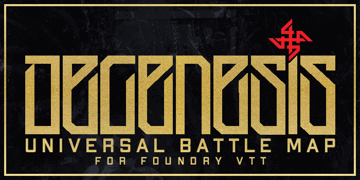

# BASIC INFORMATION

CURRENT VERSION: **0.1**  
RELEASE DATE: **03.01.2021**  
AUTHOR: **GREEDYJ4CK**

> Before use please read copyright disclaimer in main repository folder.

## ABOUT
**UBM** is a pack of graphical assets, which allow Game Masters to resolve combats without creating new maps. Square grid version is available now, hex version will be available later this year.

## INSTALLATION

Copy assets (backgrounds, tiles etc.) into your campaign data directory.

## USAGE
Recommended scene settings:
```
Scene Dimensions: 4000px x 4000px
Grid Type: Square
Grid Size: 200px
Grid Color: #b39c6b
Grid Opacity: 0.1
```

More instructions and usage examples are coming soon....
